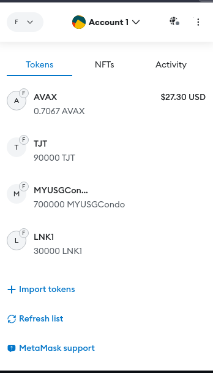
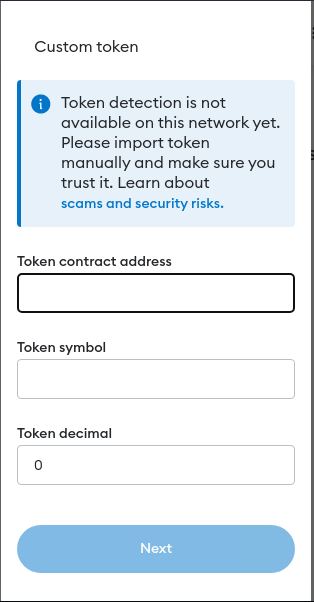

# erc1404

1. Install Node and NPM, node version 18+
2. Run `npm install`
3. Edit truffle-config.js file and add the private key mnemonic to the variable `MNEMONIC`
4. Run `truffle deploy --network avalanche_mainnet`

# Adding the custom token to Metamask

1. Select Tokens (First Tab)
2. Scroll down and click on **+ Import Token**

3. Enter the custom token's contract address (you get this after you deploy the contract to the chain) it will 
look something like this **0xde2D46BC7F6e100194f4a11B1878647Ae3E76c5f**

4. The other fields should auto complete or you can enter something custom for the name, decimal value is set to 18
5. Finish and you can see the custom token in your metamask wallet, and transfer it to other wallets